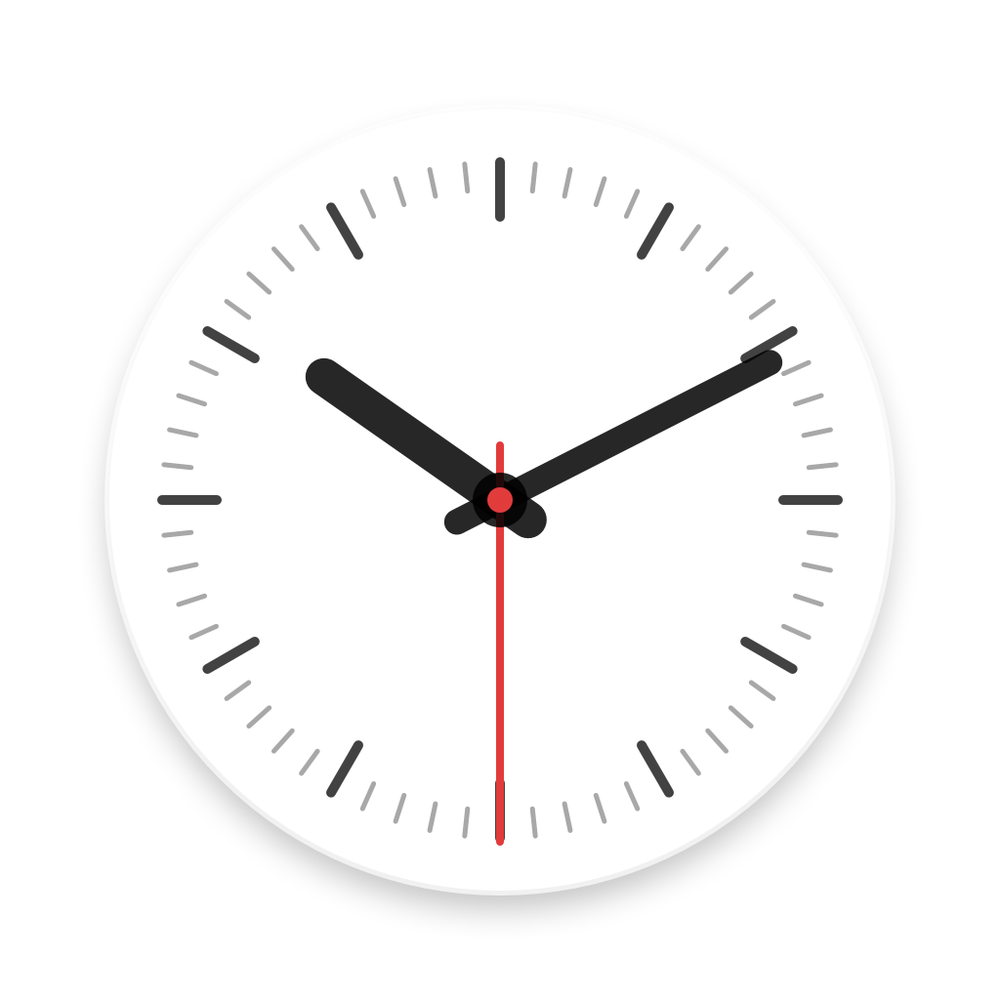
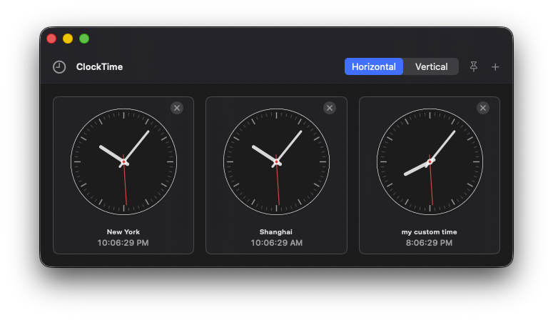

<p align="center">
  
</p>

<h1 align="center">ClockTime</h1>

ClockTime is a native macOS world clock built with SwiftUI and AppKit.

<p align="center">
  
</p>

## Features

- Add any number of clocks from the system time zone database.
- Create custom clocks with your own display name and selected time zone.
- Remove custom clocks permanently from the picker.
- Switch between horizontal and vertical layouts.
- Reorder clocks with drag and drop.
- Resize the window and the analog clocks scale with it.
- Modern macOS-style analog face with a red second hand.
- Real-time updates while the app remains open.
- Picture-in-picture style pinning so the window floats above other windows.
- Toggle Picture in Picture between transparent and solid clock cards.
- Horizontal mouse or trackpad scrolling when clocks overflow in horizontal layout.
- Dynamic Dock icon that shows the local time while the app is running.
- Persistent clocks, custom clocks, ordering, layout, and pinning preferences.

## Build and Run

```sh
swift build -c release
./scripts/package_app.sh
open .build/ClockTime.app
```

To create a distributable DMG:

```sh
swift build -c release
./scripts/package_dmg.sh
```

For development:

```sh
swift run ClockTime
```
